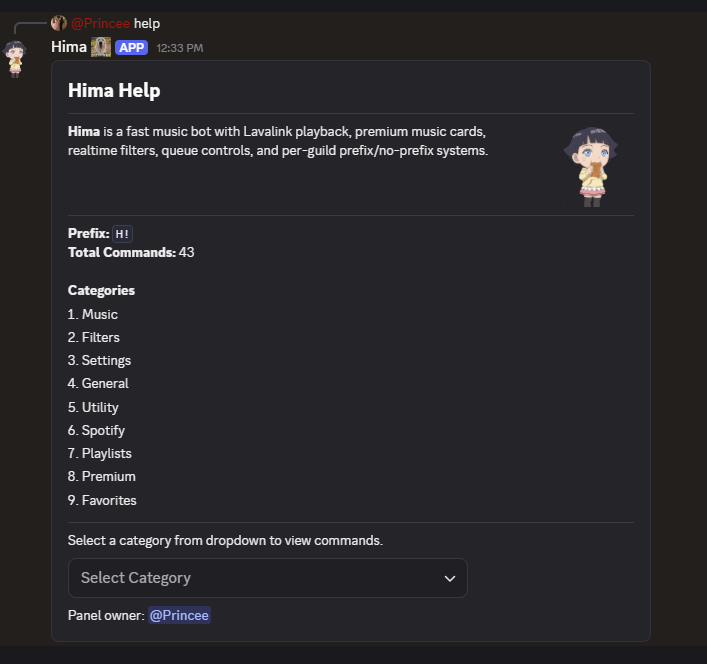
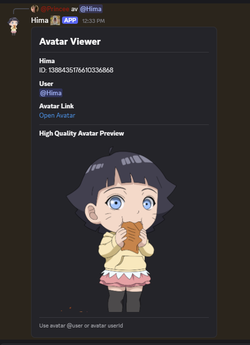
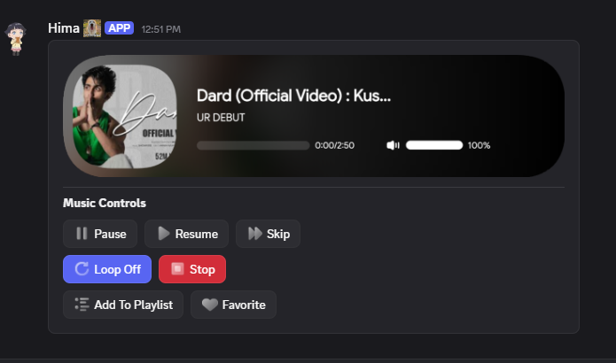
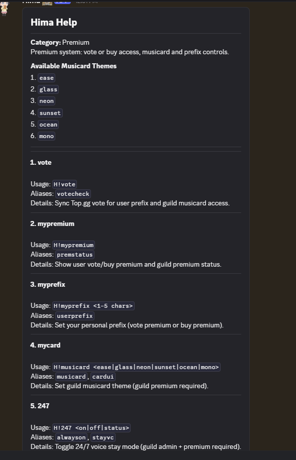

# Hima Discord Music Bot

Production-grade prefix-based Discord music bot with Lavalink + Shoukaku, Supabase-backed settings, Spotify integration, premium systems, playlists/favorites, AFK/general utilities, and Components V2 UI.

## Highlights
- Node.js `>=20`
- Discord.js v14
- Lavalink v4 via Shoukaku
- Spotify track/playlist resolve
- Supabase persistence (prefix, premium, playlists, favorites, AFK, etc.)
- Components V2 response layout
- Per-guild prefix + music channel lock
- No-prefix system (owner-managed)
- Vote premium + buy premium (token redeem)
- Music cards + controls + custom emojis
- 24/7 mode (premium)
- Cloud playlists + favorites
- AFK (server/global) with auto-clear + DM alert

---

## Project Structure

```text
src/
  bot.js
  index.js
  commands/
  components/
  config/
  database/
  favorites/
  filter/
  general/
  handlers/
  lavalink/
  music/
  musiccard/
  playlists/
  premium/
  services/
  settings/
  spotify/
  utility/
  utils/
  voiceplay/

supabase.sql
supabase_vote_premium.sql
.env.example
package.json
```

---

## Installation

```bash
npm install
```

Copy env template:

```bash
cp .env.example .env
```

Windows PowerShell:

```powershell
Copy-Item .env.example .env
```

---

## Environment Variables (`.env`)

Required:
- `DISCORD_TOKEN`
- `SUPABASE_URL`
- `SUPABASE_KEY`
- `LAVALINK_HOST`
- `LAVALINK_PORT`
- `LAVALINK_PASSWORD`
- `SPOTIFY_CLIENT_ID`
- `SPOTIFY_CLIENT_SECRET`
- `BOT_OWNER_ID`
- `NO_PREFIX_LOG_CHANNEL_ID`

Common optional:
- `LAVALINK_SECURE`
- `LAVALINK_IDENTIFIER`
- `LAVALINK_RECONNECT_TRIES` (default `999999`)
- `LAVALINK_RECONNECT_INTERVAL_MS` (default `5000`)
- `VOICE_CHANNEL_STATUS_ENABLED`
- `TOPGG_TOKEN`
- `GUILD_LOG_CHANNEL_ID` (join/leave server log channel id)
- `VOTE_PREMIUM_HOURS` (default `12`)
- `PREMIUM_VOTE_LOG_CHANNEL_ID`
- `PREMIUM_BUY_URL`
- `TOPGG_VOTE_URL`
- `SPOTIFY_SEARCH_CONCURRENCY`
- `PLAY_SEARCH_CACHE_TTL_MS`
- `VOTE_EXPIRY_CHECK_MS`
- `VOTE_EXPIRY_BATCH_LIMIT`

Premium lavalink optional:
- `PREMIUM_LAVALINK_NODES_JSON`
- `PREMIUM_LAVALINK_SSL_*`
- `PREMIUM_LAVALINK_NONSSL_*`

Custom control emoji vars:
- `MUSIC_BTN_PAUSE_EMOJI`
- `MUSIC_BTN_RESUME_EMOJI`
- `MUSIC_BTN_SKIP_EMOJI`
- `MUSIC_BTN_LOOP_EMOJI`
- `MUSIC_BTN_STOP_EMOJI`
- `MUSIC_BTN_PLAYLIST_EMOJI`
- `MUSIC_BTN_PLAYLIST_ADD_EMOJI`
- `MUSIC_BTN_FAVORITE_EMOJI`
- `MUSIC_BTN_FAVORITE_ADD_EMOJI`

---

## Supabase Setup (SQL Run Order)

Run these files in Supabase SQL editor in this order:

1. `supabase.sql`
2. `supabase_vote_premium.sql`

This creates/updates:
- `guilds`
- `no_prefix_users`
- `user_premium_profiles`
- `guild_vote_premium`
- `premium_tokens`
- `user_spotify_profiles`
- `playlists`
- `playlist_tracks`
- `playlist_settings`
- `user_favorites`
- `afk_global`
- `afk_guild`
- `afk_nicknames`

---

## Run

```bash
npm start
```

Dev mode:

```bash
npm run dev
```

---

## Command Categories

### Music
- `play`, `pause`, `resume`, `skip`, `stop`, `disconnect`
- `queue`, `nowplaying`, `volume`, `loop`, `lyrics`

### Filters
- `filter` (+ presets, list, off)

### Settings
- `prefix`
- `musicchannel` (lock music commands to one text channel)
- `config`

### Utility
- `help`, `ping`, `stats`, `uptime`, `botinfo`
- `serverstats`, `voiceinfo`, `shardinfo`, `system`
- `support`, `invite`

### Spotify
- `spconnect`, `spstatus`, `spplaylists`, `spplay`, `spdisconnect`

### Playlists
- `playlist` (create/list/add/view/load/import/export/share/autosync/autoload/etc.)

### Favorites
- `favorite` (add/list/play/play all/remove/queue add)

### Premium
- `vote`
- `mypremium`, `myprefix`, `mycard`, `247`
- `premiumtoken`, `premiumredeem`

### General
- `afk`
- `avatar`

### Owner / Access
- `noprefix`

---

## Premium Logic

### Vote Premium (Top.gg)
- User votes on Top.gg.
- `vote` command syncs premium state.
- Vote premium duration: default 12h (`VOTE_PREMIUM_HOURS`).
- On expiry, bot DM reminder with vote button (scheduler loop).
- Re-vote + `vote` command re-activates features.

### Buy Premium (Guild)
- Owner generates token via `premiumtoken`.
- Guild admin redeems via `premiumredeem`.
- Guild premium features activate for plan duration/permanent.

---

## Music Channel Lock Feature

`musicchannel` command:
- `musicchannel set #channel`
- `musicchannel show`
- `musicchannel clear`

When locked, music/playback related commands are allowed only in that configured channel.

---

## AFK System

- `afk` opens interactive mode (Server AFK / Global AFK buttons).
- AFK adds `[AFK]` in nickname (if bot can manage nickname).
- Mention/reply to AFK user shows AFK reason + since + avatar.
- AFK user receives DM notification (if DMs open).
- Any message by AFK user auto-removes AFK and restores nickname.

---

## Voice Channel Song Status

When a track starts, bot updates voice channel status with current song.
- Controlled by env: `VOICE_CHANNEL_STATUS_ENABLED=true`
- Clears status on stop/disconnect/queue end.

---

## Spotify Notes

- Spotify URL resolve uses Spotify Web API + Lavalink search fallback.
- Playlist imports are chunked and optimized.
- Speed tuning via:
  - `SPOTIFY_SEARCH_CONCURRENCY`
  - `PLAY_SEARCH_CACHE_TTL_MS`

---

## Components V2 UI

Bot replies are structured with container-based Components V2 layouts.
Most interactive panels include:
- buttons
- select menus
- pagination where required
- media gallery/music card rendering

---

## Troubleshooting

### Bot online but no command response
- Check message content intent enabled in Discord Developer Portal.
- Verify prefix (`prefix` / `config`).
- If `musicchannel` lock enabled, run commands in configured channel.

### Lavalink reconnect/403 errors
- Recheck host/port/password/secure in `.env`.
- Node must be compatible with Lavalink v4 and reachable from your server.

### Spotify errors
- Validate `SPOTIFY_CLIENT_ID` and `SPOTIFY_CLIENT_SECRET`.
- Ensure app credentials are active and not revoked.

### Supabase failures
- Verify `SUPABASE_URL`, `SUPABASE_KEY`.
- Re-run SQL files after schema updates.

### Missing premium behavior
- Ensure `TOPGG_TOKEN` is set.
- Use `vote` command after voting.
- Check premium log channel configuration.

---

## Deployment Notes
- Node.js 20+ required.
- Keep `.env` secret; never commit real tokens.
- For production, run with PM2/systemd or your preferred process manager.

---

## License
Private/custom project. Add your preferred license before publishing.


## UI Showcase

<p align="center">
  
</p>

<p align="center">
  
  
</p>

<p align="center">
  
</p>

